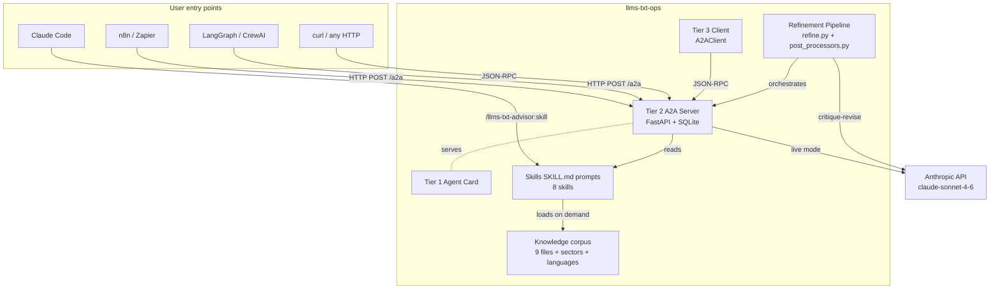
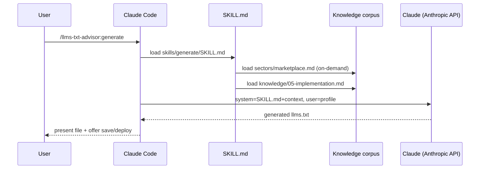

# Architecture

> [!abstract] One-paragraph summary
> A Claude Code plugin (8 skills) + an A2A v1.0 server callable from anywhere (Docker / Render / Fly / Railway / n8n / LangGraph / CrewAI). Skills are defined by `SKILL.md` files with frontmatter triggers; the live A2A server feeds the SKILL.md as system prompt and the user message as user prompt to `claude-sonnet-4-6`. A quality-refinement pipeline (Best-of-N + [[Self-Refine]] + [[Post-Processors|deterministic post-processors]]) closes the last 5-10% to gold-standard quality.

---

## High-level diagram

---

## Component map

| Layer | Component | Note |
|---|---|---|
| Discovery | [[A2A Tier 1 - Agent Card]] | `.well-known/agent-card.json` |
| Server | [[A2A Tier 2 - Server]] | `scripts/a2a-server.py` (FastAPI + JSON-RPC + SQLite + SSE) |
| Client | [[A2A Tier 3 - Client]] | `scripts/a2a-client.py` (async + CLI) |
| Refinement | [[Quality Refinement Pipeline]] | `scripts/refine.py` (Best-of-N + Self-Refine + post-process) |
| Post-processing | [[Post-Processors]] | `scripts/post_processors.py` (deterministic) |
| Skills | 8 skills | `skills/*/SKILL.md` |
| Knowledge corpus | 9 numbered files + sectors + languages | `knowledge/` |
| Cookbook | [[Cookbook - Staleness Watcher]] | `managed-agent-cookbooks/staleness-watcher/` |
| Integrations | n8n + LangGraph + CrewAI + Python + curl | [[Integrations]] |
| Deploys | Docker · Render · Fly · Railway · self-hosted | [[Deploy targets]] |

---

## Skill invocation flow

For the full path with refinement, see [[Quality Refinement Pipeline]].

---

## Architecture patterns adopted

| Pattern | Source repo |
|---|---|
| Two-CLAUDE.md template + cold-start + bounce-on-placeholder | `anthropics/claude-for-legal` |
| `~~category` placeholders + Standalone-vs-Supercharged | `anthropics/knowledge-work-plugins` |
| Agent + vertical split + sync.py + 3-tier cookbook | `anthropics/financial-services` |
| Meta-skill recommender | `claude-for-legal/legal-builder-hub` |
| Skill-creator eval workflow | `anthropics/skills` |

See [[Versioning policy]] for how patterns evolve here.

---

## Related notes

- [[Map of Content]] — top-level index
- [[A2A Protocol]] — protocol-level details
- [[Quality Refinement Pipeline]] — SOTA refinement
- [[Empirical baseline]] — the honest stance baked into every skill
