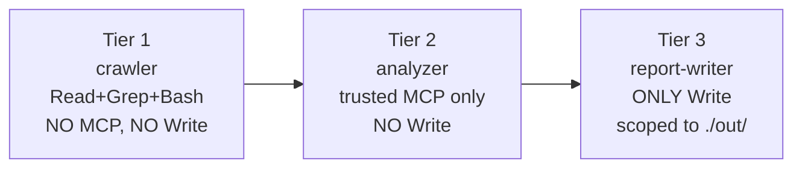

# Cookbook — Staleness Watcher

> [!important] 3-tier security split
> Pattern adopted from `anthropics/financial-services`. Each tier has the minimum capability surface area for its job.

## The three tiers



| Tier | Subagent | Capabilities | Why |
|---|---|---|---|
| 1 | `crawler.yaml` | Read, Grep, Bash | Touches untrusted HTML; no MCP, no Write |
| 2 | `analyzer.yaml` | GitHub MCP, Bing AI Performance MCP, Profound MCP | Trusted MCP only; cannot write |
| 3 | `report-writer.yaml` | Write only, scoped to `./out/<domain>/` | Only the writer can write |

## What it does

Quarterly (or on-schedule) health-check for a deployed `llms.txt`:

1. **Crawler** fetches the live llms.txt, robots.txt, sitemap.xml
2. **Analyzer** correlates with GitHub change history + Bing AI Performance metrics + Profound citations data
3. **Report-writer** emits a markdown report identifying drift, broken links, citation trend, action items

## Deploy

```bash
# Dry-run (default, no API call)
bash scripts/deploy-managed-agent.sh staleness-watcher

# Live (requires Anthropic Managed Agents API access + MCP env-vars)
export ANTHROPIC_API_KEY=sk-ant-...
export GITHUB_MCP_URL=https://...
export BING_WEBMASTER_MCP_URL=https://...
export PROFOUND_MCP_URL=https://...
bash scripts/deploy-managed-agent.sh staleness-watcher --live
```

## Source

- `../managed-agent-cookbooks/staleness-watcher/agent.yaml`
- `../managed-agent-cookbooks/staleness-watcher/subagents/`
- `../scripts/deploy-managed-agent.sh`
- `../agents/staleness-watcher.md` (system prompt)

## Related

- [[Architecture]]
- [[A2A Tier 2 - Server]] — alternative deployment substrate
- [[Deploy targets]]
