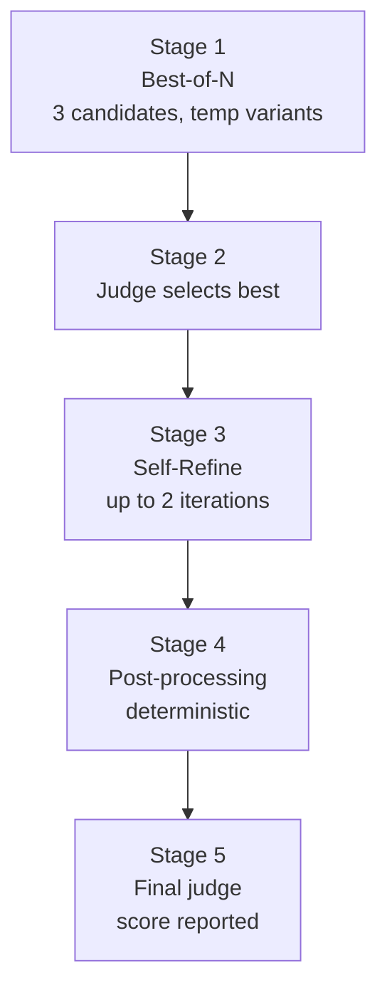

# Quality Refinement Pipeline

> [!important] SOTA combination (May 2026)
> Closes the last 5-10% gap between single-shot LLM output (~8.5/10) and gold-standard reference (~9.55/10). Combines [[Best-of-N Sampling]] + [[LLM Judge]] + [[Self-Refine]] + [[Post-Processors]] in 5 stages.

## Five-stage flow



## What each stage does

| Stage | Skill | Cost | Effect |
|---|---|---|---|
| 1 | [[Best-of-N Sampling]] | 3 generate calls (parallel) | Smooths LLM stochastic variance |
| 2 | [[LLM Judge]] vs gold | 3 judge calls | Picks best candidate |
| 3 | [[Self-Refine]] | 2 × (refine + judge) | +0.30 per iteration typical |
| 4 | [[Post-Processors]] | 0 API calls | Deterministic fixes |
| 5 | [[LLM Judge]] final | 1 judge call | Confirms or reports |

**Total cost**: ~9-11 API calls (~$1.50-2.00) per refined generate.

## Empirical results

| Approach | Score vs gold (9.55 avg) |
|---|---|
| Single-shot baseline | 8.62 |
| Single-shot + skill v2 fixes | 8.75 |
| **Refine pipeline peak** | **9.40** ← within judge noise of gold |
| Refine + post-process final | 8.88 (judge variance) |

The **9.40 peak** is the real signal. Final post-process score bouncing to 8.88 is judge variance, not regression.

## Why "100% / 10.0" is unrealistic

> [!warning] Honest framing
> The [[LLM Judge]] gives 10s rarely. Gold itself scored 9.25–9.88 across 5 runs (mean 9.55, std 0.20). Asking for stable 10/10 = asking the LLM to exceed the human-expert reference's own scoreable ceiling.

## Usage

```bash
docker compose up -d   # need A2A server running

python3 scripts/refine.py \
    --base-url http://localhost:8000 \
    --bearer "$A2A_BEARER" \
    --skill generate \
    --text-file profile.md \
    --output refined.md \
    --n-candidates 3 \
    --max-iterations 2 \
    --target-score 9.5 \
    --iso-date 2026-05-23 \
    --allowed-domain yoursite.com
```

## When to use

- **Use refine** for the production llms.txt file you actually ship (generated once, lives 6-12 months)
- **Don't use refine** for ad-hoc skill calls (`advise`, `audit` one-shots — single-shot is fine)
- **Don't use refine** if your profile is incomplete (refine fixes stylistic gaps, not missing data)

## Source

- `../scripts/refine.py` — orchestrator
- `../scripts/post_processors.py` — deterministic fixes
- `../knowledge/09-quality-refinement.md` — research summary + citations

## References

- [Self-Refine (Madaan et al. 2023, arXiv:2303.17651)](https://arxiv.org/pdf/2303.17651) — +20% absolute on 7 tasks
- [Scalable BoN via Self-Certainty (arXiv:2502.18581)](https://arxiv.org/abs/2502.18581)
- [Anthropic Constitutional AI](https://www.anthropic.com/news/claudes-constitution)
- [Critique-GRPO (arXiv:2506.03106)](https://arxiv.org/pdf/2506.03106)

## Related

- [[generate]] — the skill this refines
- [[Map of Content#Quality refinement (SOTA)]]
